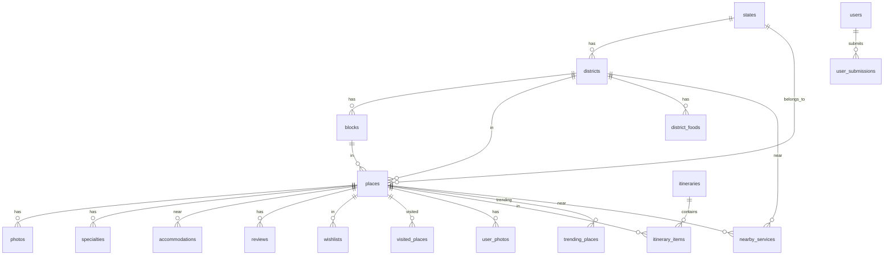

# HiddenYatra — Database Documentation

## Overview

MySQL 8.x with InnoDB engine, utf8mb4 character set, managed via DBUtils PooledDB connection pooling.

## Schema (23 Tables)

### Entity-Relationship Diagram



### Table Reference

| # | Table | Purpose | Rows (typical) |
|---|---|---|---|
| 1 | `states` | Indian states (Bihar primary) | 1-5 |
| 2 | `districts` | Districts within states | 38 |
| 3 | `blocks` | Blocks within districts | 100+ |
| 4 | `places` | Tourist spots, temples, etc. | 200+ |
| 5 | `photos` | Official place photos | 500+ |
| 6 | `specialties` | Local specialties per place | 100+ |
| 7 | `accommodations` | Hotels/stays near places | 50+ |
| 8 | `users` | Registered users | Variable |
| 9 | `wishlists` | Session-based wishlists | Variable |
| 10 | `reviews` | Place reviews (1-5 stars) | Variable |
| 11 | `itineraries` | Trip plans | Variable |
| 12 | `itinerary_items` | Items in trip plans | Variable |
| 13 | `user_submissions` | Community place suggestions | Variable |
| 14 | `visited_places` | Places marked as visited | Variable |
| 15 | `district_foods` | Famous foods per district | 100+ |
| 16 | `nearby_services` | Services near places | Variable |
| 17 | `admin_logs` | Admin action audit trail | Growing |
| 18 | `hero_media` | Homepage hero backgrounds | 5-20 |
| 19 | `hero_settings` | Hero display config (singleton) | 1 |
| 20 | `trending_places` | Admin-curated trending | 8-20 |
| 21 | `homepage_sections` | Homepage layout config | 6 |
| 22 | `auth_appearance` | Login/signup page config (singleton) | 1 |
| 23 | `user_photos` | User-uploaded photos (moderated) | Variable |

### Key Constraints

- **Foreign Keys**: All child tables use `ON DELETE CASCADE` or `ON DELETE SET NULL`
- **Unique Keys**: Slugs, email, username, session+place pairs
- **CHECK Constraints**: Rating 1-5, opacity 0-1, singleton IDs
- **ENUM Types**: `users.status`, `user_submissions.status`, `user_photos.status`

### Index Strategy

| Index | Table | Columns | Purpose |
|---|---|---|---|
| `uq_places_slug` | places | slug | Unique place URLs |
| `idx_places_featured_views` | places | is_featured, view_count DESC | Homepage featured sorting |
| `ft_places_search` | places | name, description (FULLTEXT) | Full-text search |
| `idx_places_deleted` | places | deleted_at | Soft delete filter |
| `idx_places_slug_deleted` | places | slug, deleted_at | Composite for slug lookup |
| `idx_places_lat_lng` | places | latitude, longitude | Nearby queries |
| `idx_reviews_place_created` | reviews | place_id, created_at DESC | Sorted review listing |
| `idx_districts_visible` | districts | is_visible, sort_order | Homepage district listing |
| `idx_submissions_status` | user_submissions | status | Pending queue filter |

### Connection Pool Configuration

```python
PooledDB(
    creator=pymysql,
    maxconnections=20,     # DB_POOL_MAX
    mincached=5,           # DB_POOL_SIZE
    maxcached=5,
    blocking=True,         # Wait for connection
    maxusage=0,            # Unlimited reuse
    ping=1,                # Auto-reconnect stale connections
    autocommit=False,      # Explicit commits only
)
```

### Migration Notes

1. **Schema file**: `scripts/migrations/mysql_schema.sql` — run to create all tables
2. **Rollback**: `scripts/migrations/mysql_rollback.sql` — drops all tables safely
3. **Data migration**: `scripts/migrations/migrate_sqlite_to_mysql.py` — one-time migration tool
4. **Seed data**: `scripts/seed/seed_bihar_complete.py` — full Bihar dataset
